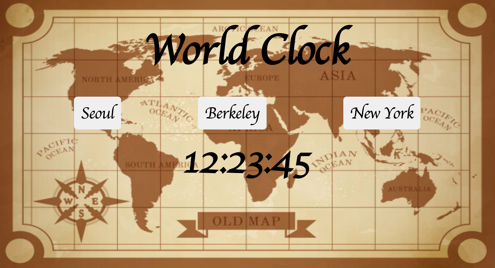

# World Clock Project

## Webpage
[World Clock Page Homepage Link](https://yjclarelee.github.io/world_clock)

## v.0.1.0
Date: 2021.03.15

### Refactoring
#### HTML
- Added Open Graph information
- Make HTML semantic
- Use classes instead of ids

#### CSS
- Remove unneeded code

#### JS
- Use querySelector instead of getElementById(the latter's performace is worse)
- Remove unneeded nesting of event listener
- Use event delegation!!
- Rename variables according to camel case
- Declare variables separately instead of concatination with commas
- Add a helper function(padZero)

## v.0.0.0
Date: 2021.01.02
### Functionality
The clock changes when the buttons of the cities are clicked

### Implementation
~~- Nested addEventListener~~
- Usage of setInterval and clearInterval to switch time between cities

### Cities
Seoul, Berkeley and New York

